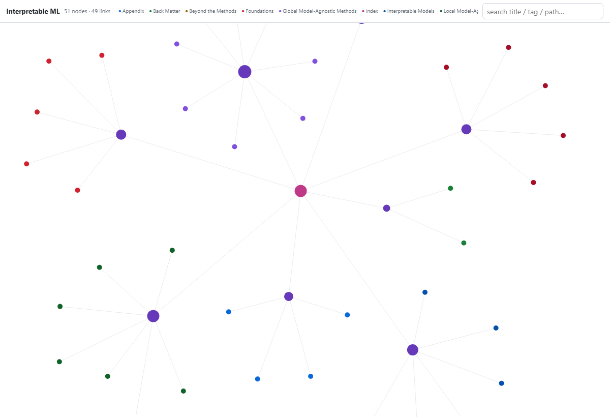

A 500-page machine-learning book is a great thing to *read* and an awful thing to
*query*. What chapters cover local methods? Where, exactly, is the Shapley-value
explanation? What links to what? You can grep, or you can turn the book into a
small **knowledge graph** you can run SQL, graph queries, and semantic search
against — in about thirty lines of R, deterministically, with no LLM agent in the
loop.

That's what [**okf-ingest**](https://github.com/travisjakel/okf-ingest) does. It
reads an [Open Knowledge Format](https://github.com/GoogleCloudPlatform/knowledge-catalog)
(OKF) bundle — a folder of markdown files with YAML frontmatter, one concept per
file, markdown links as the graph — and loads it into a portable **DuckDB
catalog** you can query from R or Python. Here I'll point it at Christoph
Molnar's openly-licensed [*Interpretable Machine
Learning*](https://github.com/christophM/interpretable-ml-book) (CC BY-NC-SA).

> **What is OKF?** [Open Knowledge Format](https://github.com/GoogleCloudPlatform/knowledge-catalog)
> (Google Cloud, v0.1) is a deliberately boring convention: a folder of markdown
> files, **one concept per file**, each with a little YAML frontmatter. The only
> required field is `type`; `title`/`description`/`timestamp`/`tags` are
> recommended. Ordinary markdown **links are the graph**, and two filenames are
> reserved — `index.md` (the map) and `log.md` (the history). That's the whole
> spec: no database, no SDK, no required tooling — if you can `cat` a file, you
> can read OKF. okf-ingest is just a *reader* that turns one of these folders into
> something queryable.

## Step 1 — install, and grab the book

```r
install.packages("okf", repos = c(travisjakel = "https://travisjakel.r-universe.dev",
                                   CRAN = "https://cloud.r-project.org"))
# in a shell:  git clone --depth 1 https://github.com/christophM/interpretable-ml-book src
```

## Step 2 — make it OKF (the only "conversion" step)

The book is 47 Quarto `.qmd` chapters grouped into Parts in its `_quarto.yml`. OKF
just wants per-file frontmatter with a `type` and links that form a graph, so the
converter is small: give each chapter a `type` (its Part — which becomes the
graph's colour), a title and one-sentence description, strip the Quarto-only
directives, and emit one `index.md` → Part pages → chapters so the structure is a
real graph rather than a flat list.

```r
src <- "src/manuscript"; out <- "iml-okf"; ts <- "2025-04-13T00:00:00Z"
dir.create(out)
parts <- list(
  "Foundations" = c("intro","interpretability","goals","overview","data"),
  "Interpretable Models" = c("limo","logistic","extend-lm","tree","rules","rulefit"),
  "Local Model-Agnostic Methods" = c("ceteris-paribus","ice","lime","counterfactual","anchors","shapley","shap"),
  "Global Model-Agnostic Methods" = c("pdp","ale","interaction","decomposition","feature-importance","lofo","global","proto"),
  "Neural Network Interpretation" = c("cnn-features","pixel-attribution","detecting-concepts","adversarial","influential"),
  "Beyond the Methods" = c("evaluation","storytime","future","translations"),
  "Back Matter" = c("cite","acknowledgements"),
  "Appendix" = c("what-is-machine-learning","math-terms","r-packages","references"))

clean <- function(x) {                                # keep prose; concept links come from structure
  x <- x[!grepl("^\\s*(\\{\\{<|:::)", x)]             # drop Quarto directives
  x <- sub("\\s*\\{#[^}]+\\}\\s*$", "", x)            # strip {#label} from headings
  x <- gsub("!\\[[^]]*\\]\\([^)]*\\)", "", x)         # remove image embeds
  gsub("\\[([^]]+)\\]\\([^)]*\\)", "\\1", x)          # de-link to plain prose
}
fm <- function(type, title) c("---", paste0("type: ", type),
  paste0("title: \"", gsub('"',"'",title), "\""), paste0("timestamp: ", ts),
  "tags: [interpretable-ml]", "---", "")

for (part in names(parts)) for (stub in parts[[part]]) {
  raw <- readLines(file.path(src, paste0(stub, ".qmd")), warn = FALSE, encoding = "UTF-8")
  title <- trimws(sub("\\{#[^}]+\\}", "", sub("^#\\s+", "", raw[grepl("^#\\s", raw)][1])))
  writeLines(c(fm(part, title), clean(raw)), file.path(out, paste0(stub, ".md")))
}
for (part in names(parts)) {
  ps <- paste0("part-", gsub("[^a-z0-9]+","-",tolower(part)))
  writeLines(c(fm("Part", part), paste0("# ", part), "",
               sprintf("- [%s](%s.md)", parts[[part]], parts[[part]])),
             file.path(out, paste0(ps, ".md")))
}
writeLines(c(fm("Index","Interpretable Machine Learning"), "# Interpretable Machine Learning", "",
             sprintf("- [%s](part-%s.md)", names(parts), gsub("[^a-z0-9]+","-",tolower(names(parts))))),
           file.path(out, "index.md"))
```

> Already keep notes in Obsidian/Logseq/Foam? Skip most of this — okf-ingest resolves `[[wikilinks]]` by name (id / alias / title, rename-safe), so a vault is already an OKF bundle in all but the frontmatter `type`.

## Step 3 — ingest, and you have a catalog

```r
library(okf)
res <- okf_ingest("iml-okf", db_path = "iml.duckdb")
res$summary[c("n_concepts","links_total","links_broken","conformant")]
#> n_concepts 49 · links_total 49 · links_broken 0 · conformant TRUE
```

49 concepts (41 chapters + 8 Part pages), a clean link graph, conformant. It's
just DuckDB now, so ask it anything:

```r
DBI::dbGetQuery(res$con,
  "SELECT type, count(*) n FROM okf_concept WHERE reserved = FALSE
   GROUP BY type ORDER BY n DESC")
#>  Global Model-Agnostic Methods 8 · Local Model-Agnostic Methods 7
#>  Interpretable Models 6 · Foundations 5 · Neural Network Interpretation 5 · ...
```

## Step 4 — health check (`okf doctor`)

```r
d <- okf_doctor(res$con)
d$score        #> 100      (percentage of concepts with zero findings)
d$by_rule      #> named list() — nothing flagged: no broken links, orphans, or missing fields
```

`doctor` is the maintenance gate: broken links, orphans, missing fields, stale
timestamps, with CI exit codes and an opt-in `--fix` for the unambiguously-safe
repairs. Our freshly-converted bundle passes clean.

## Step 5 — see it

```r
okf_graph_html(res$con, "iml-graph.html")   # one self-contained, interactive page
```



No CDN, no framework — a hand-rolled force-directed canvas you can pan, zoom, and
search; click a node to open its rendered page. (`okf html` renders the whole
bundle as a navigable site; `okf export --mermaid` gives you a diagram for your
README.)

## Step 6 — ask it a question (semantic search)

Optionally embed the bodies and run retrieval. This is the **one** place a model
is involved, and it's a *local, swappable* embedder (Ollama by default) — nothing
leaves your machine:

```r
okf_embed(res$con)                                   # 1369 chunks, local nomic-embed-text
okf_rag(res$con, "How are Shapley values used to explain a prediction?", k = 4)[, c("score","title")]
#>  0.852  Shapley Values
#>  0.848  Shapley Values
#>  ...
```

## Why this and not an "AI that reads your docs"

okf-ingest is **deterministic and agent-free**: the same bundle in always yields
the same catalog, graph, and render — offline, no API key, reproducible enough to
assert on in CI. It never asks a model to summarise or infer relationships; it
reads exactly the structure the author wrote, and hands *you* the graph (via
`okf context`) when you want to bring your own LLM. The only model touch is the
opt-in `embed`/`rag` layer above.

And it's two bindings over one catalog. The exact same bundle, ingested in
**Python**, gives the byte-identical result:

```bash
pip install okf-ingest        # or: uv add okf-ingest
python -c "import okf.okf as okf; print(okf.ingest('iml-okf')[1]['n_concepts'])"   # 49
```

Ingest in R, query in Python, or vice-versa.

---

*okf-ingest is open source (Apache-2.0) on [GitHub](https://github.com/travisjakel/okf-ingest),
[R-universe](https://travisjakel.r-universe.dev/okf) and
[PyPI](https://pypi.org/project/okf-ingest/). The book is* Interpretable Machine
Learning *by Christoph Molnar, used here under CC BY-NC-SA; the conversion is for
demonstration — read the real thing at <https://christophm.github.io/interpretable-ml-book/>.*
